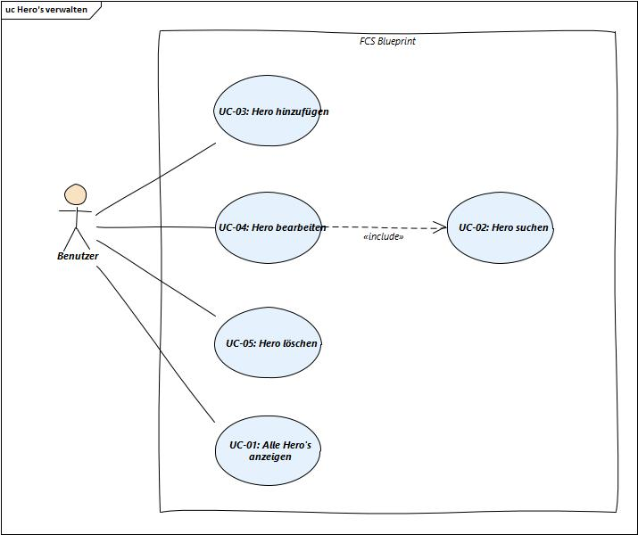
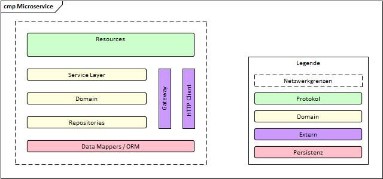
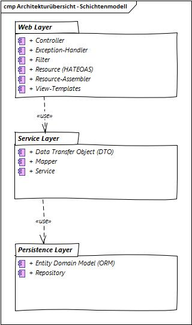
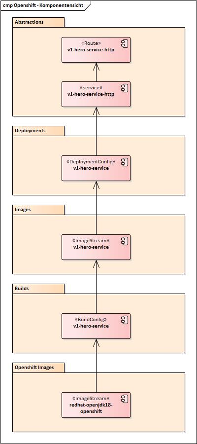

# Einleitung
In diesem Projekt geht es um die Implementierung von [Tours of Heroes](https://angular.io/tutorial) als Musteranwendung mit Java und Spring Boot. Spring Boot vereinfacht die Implementierung von Java-Anwendungen mit dem Spring-Framework. Zusätzlich unterstützt Spring Boot den Betrieb von Anwendungen ohne Application Server und ist deshalb bestens geeignet für den Betrieb mit Openshift.

## Zweck der Anwendung
Ziel des Musterbeispiels ist es, einen umfassenden Überblick über die Entwicklung eines Microservices zu vermitteln, wobei unterschiedliche Aspekte mittels verschiedenen architektonischen Sichten aufgezeigt werden. 

##	Zielgruppe
Dieses Projekt richtet sich primär an Software-Architekten, Lead Developer, Software-Entwickler und weitere am Entwicklungsprozess beteiligte Personen. Da es sich um ein technisches Artefakt handelt werden Kenntnisse der Softwareentwicklung vorausgesetzt.

# Anforderungen
Die Lösung der Anwendung muss nach Microservice-Architekturstil realisiert werden. Dieser Ansatz sieht vor, alle Interaktionen im System und mit der Datenbank über die REST-Schnittstelle abzubilden. 

## Funktionale Anforderungen



Die wichtigsten funktionalen Anforderungen lauten wie folgt:

| Use Case (UC) | Kurzbeschreibung | 
|-----------|-----------|
| UC-01: Alle Hero's anzeigen | Alle Hero's werden angezeigt. |  
| UC-02: Hero suchen | Ein spezifischer Hero kann nach Name gesucht werden. |
| UC-03: Hero hinzufügen | Ein Hero wird erfasst. |
| UC-04: Hero bearbeiten | Ein spezifischer Hero wird geändert. |
| UC-05: Hero löschen | Ein spezifischer Hero wird gelöscht. |

## Nicht-Funktionale-Anforderungen
Folgende Nicht-Funktionale Anforderungen müssen erfüllt werden

| NFA | Kurzbeschreibung | 
|-----------|-----------|
| Erweiterbarkeit | Das System soll leicht erweiterbar sein. | 
| Testbarkeit | Das System muss einfach testbar sein.| 
| Skalierbarkeit | Das System muss skalierbar sein. | 
| Wiederverwendbarkeit | Das System muss wiederwendbar sein. | 
| Sicherheit | Das System ist für den unauthorisierten Zugriff geschützt. | 

# Einflussfaktoren
## Technische Einflussfaktoren
Die technischen Einflussfaktoren sind wie folgt: 

| Randbedingung| Kurzbeschreibung                                                                                                                                                                                                                                                  | 
|-----------|-------------------------------------------------------------------------------------------------------------------------------------------------------------------------------------------------------------------------------------------------------------------|
| Software-Infrastruktur | Openshift als PaaS, OpenJDK für das Zielsystem                                                                                                                                                                                                                    |
| Systembetrieb | Verteilte Serveranwendung                                                                                                                                                                                                                                         |
| Grafische Oberfläche | Keine, Bedienung kann mit Postman oder SoapUI erfolgen                                                                                                                                                                                                            |
| Bibliotheken, Frameworks und Komponenten  | Spring Boot Web, Spring HATEOAS, Spring Data JPA mit Hibernate ORM und Datenbank H2 , Kontinuerliche Datenbankmigration mit Liquibase, REST-Schnittstellendokumentation mit Swagger, Testing mit JUnit &amp; Mockito, Java SE 19 mit Apache Maven und Eclipse IDE |
| Programmiersprachen | Java                                                                                                                                                                                                                                                              |
| Analyse- und Entwurfsmethoden  | Objektorientiertes Vorgehen, Klassisches Schichtenmodell, [Twelve-Factor App](https://12factor.net/de/) Prinzip, [Semantische Versionierung](https://semver.org/lang/de/), Git-Flow als Branching-Model für Versionierung in Softwareprojekten                    | 
| Datenstrukturen  | Objektmodell der Zielumgebung bekannt                                                                                                                                                                                                                             | 
| Programmierrichtlinien  | Sonar für Java                                                                                                                                                                                                                                                    |
| Technische Kommunikation  | REST Level 3 nach Richardson Maturity Model: HATEOAS (Hypertext As The Engine Of Application State) im [HAL  (Hypertext Application Language)](http://stateless.co/hal_specification.html) Format                                                                 |
 
# Logische Sicht

## Systemkontext
Die Kontextabgrenzung grenzt das System oder das Produkt von allen Nachbarsystemen ab. Sie legt
damit die wesentlichen externen Schnittstellen fest.

### Servicekonsument
Der Servicekonsument verwendet eine Anwendung wie z.B. einen Webbrowser oder Postman um Anfragen via HTTP über die Schnittstelle I1 zu machen.


## Architekturübersicht

Dieses Projekt wird als Microservice realsiert. Ein Microservice ist ein Architekturstil für die Erstellung von Anwendungen. Dieser verfolgt den Ansatz komplexe Anwendungen modular aufzubauen. In der folgenden Abbildung werden die Bausteine eines Microservices dargestellt.



Um die Trennung von Zuständigkeiten zu erreichen, gliedern wir das System in Schichten und Komponenten mit jeweils abgeschlossenen Aufgaben. Die Anwendung ist in mehrere logische Schichten unterteilt. Der gesamte Datenbankzugriff wird in der Datenzugriffsschicht bewerkstelligt. Darauf setzt die Serviceschicht auf, welche die Geschäftsprozesse implementiert. Um die Schnittstelle für Servicekonsumenten anzubieten, wird die Webserviceschicht verwendet.



# Implementation-Sicht
In diesem Kapitel werden die wichtigsten eingesetzten Komponenten sowie deren Zusammensetzung für das Projekt beschrieben. Diese Beschreibung umfasst die Zuordnung von Komponente zu Produkt, sowie die gegenseitige Abhängigkeiten und das Zusammenspiel zwischen den Subsystemen und zu den Umsystemen. Des Weiteren wird auf die Implementation des Datenmodells eingegangen. 

## Überblick
Das Projekt ist als Maven-Multimodulprojekt mit Corporate POM in Form von ""Hierarchical Project Layout"" aufgebaut. Diese hierarchische Variante ist optimal für Maven, aber etwas umständlich bei der Handhabung mit Eclipse. Die Organisation Software+ verwaltet mehrere Projekte (oder Multimodulprojekte), deshalb werden gemeinsame Einstellungen der Projekte zentral verwaltet, 
nämlich in einer [Corporate POM](https://blog.sonatype.com/2008/05/misused-maven-terms-defined/) (oder Master POM). 

Die Struktur der wichtigsten Projektartefakte sieht folgendermassen aus:

```
Workspace
 '- tour-of-heroes-parent (Git-Repository)
     |- pom.xml (Parent-POM)
     '- tour-of-heroes
     |   |- pom.xml (Modul-POM)
     |   '- src ...
     |- configuration
         '- settings.xml (Einstellung für Maven auf Openshift)
```

Das Modulprojekt hat die folgenden Eigenschaften:

| Eigenschaft| Beschreibung | Wert |
|-----------|-----------| -----------|
| GroupId  | Ordnet das Projekt in der Organisation ein. | ch.softwareplus.blueprints |
| ArtifactId | Name des Projekts in Kurzschreibweise. | tour-of-heroes-api |
| Version | Gibt die aktuelle Version des Projekts an. | 1.0.0-SNAPSHOT |
| Packaging | Gibt die Verpackung des Projekts an. Diese kann jar, war, ejb, etc. sein. | jar |
| Name | Der vollständige Name des Projekts. | Tour of Heroes |
| Description | Die Beschreibung des Projekts. | Dieses Projekt ist die Implementierung von Tours of Heroes mit Java und Spring Boot. |

# Prozess-Sicht

Die Prozesse der Anwendung laufen auf der Openshift Plattform bzw. auf JVM Laufzeitsystemen. Diese Plattformen bieten herstellerspezifische Lösungen zur Ablaufsteuerung, zum Umgang mit Betriebssystemressourcen, Handhabung von konkurrierenden Zugriff usw. 

# Deployment-Sicht

## Plattformarchitektur


## Betrieb und Unterhalt

Dieses Kapitel liefert alle Informationen, die der Betrieb benötigt, um das System ordnungsgemäss zu betreiben und im Falle von Problemen richtig zu reagieren. Folgende Themen werden in diesem Kapitel bearbeitet:
- Aufnahme des Betriebs
- Durchführung und Überwachung des Betriebs
- Unterbrechung oder Beendigung des Betriebs
- Spezielle Sicherheitsbestimmungen

Unter einem System werden die Infrastruktur und die Applikation verstanden. Hier sind spezifische Informationen / Abläufe zum Betrieb der Applikation efasst. 

## Installation und Konfiguration
Die Installation und Konfiguration der Anwendung geschieht auf Openshift. Die Serveranwendung wird mittels JAR auf Openshift bereitgestellt.

## Software- Update und –Verteilung

## Monitoring, Laufzeitanalyse und Log- Analyse

# Risiken und Issues
Risiken und Issues werden im TFS geführt. Relevante Punkte sind hier referenziert.

# Offene Punkte

TBD